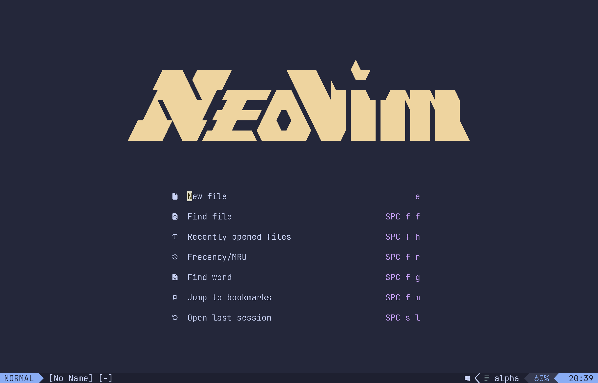
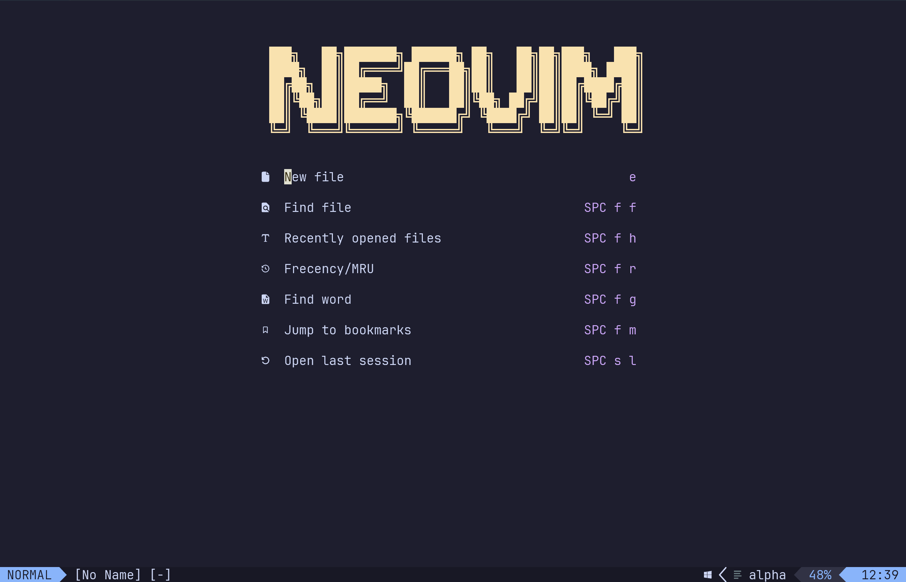

# ***NeoVim-Setting***
>Just <strong><em>`init.lua`</em></strong>

<br>
<h3><strong>How do I quit Vim?</strong></h3>

<br>
  

#### ___Remember to download "Lazy.nvim", "ripgrep" and "fd"___

### ***Plugins:***
   * ● alpha-nvim 
   *  ● catppuccin <em>(4 themes)</em>
         * Latte <em>(light theme)</em>
         * Frappe <em>(semi-light theme)</em>
         * Macchiato <em>(semi-dark theme)</em>
         * Mocha <em>(dark theme)</em>
   * ● cmp-nvim-lsp | cmp_nvim_lsp | nvim-lspconfig
   * ● conform.nvim  
   * ● lazy.nvim 
   * ● lualine.nvim 
   * ● mason-lspconfig.nvim | nvim-lspconfig
   * ● mason.nvim | nvim-lspconfig
   * ● neo-tree.nvim 
   * ● noice.nvim 
   * ● nui.nvim | snacks.nvim
   * ● nvim-lspconfig
   * ● nvim-notify | noice.nvim
   * ● nvim-web-devicons | alpha-nvim
   * ● plenary.nvim | snacks.nvim
   * ● snacks.nvim 
   * ● telescope.nvim 
   * ○ cmp-buffer | nvim-cmp 
   * ○ cmp-path | nvim-cmp 
   * ○ cmp_luasnip | nvim-cmp 
   * ○ friendly-snippets | nvim-cmp 
   * ○ LuaSnip | nvim-cmp 
   * ○ nvim-cmp | InsertEnter
```
-- Set leader key
vim.g.mapleader = " "
-- 👁️ Hiển thị số dòng
vim.opt.number = true
vim.opt.relativenumber = false -- hoặc true nếu bạn thích dòng tương đối

-- ⬅️ Cấu hình tab & thụt lề
vim.opt.tabstop = 4 -- số space cho mỗi tab
vim.opt.shiftwidth = 4 -- số space khi thụt dòng bằng >>
vim.opt.expandtab = true -- dùng space thay vì ký tự tab
vim.opt.smartindent = true
-- 🎨 Tô màu xanh cho viền của Neo-tree
vim.cmd([[highlight NeoTreeBorder guifg=#80a0ff]])

-- Load lazy.nvim
local lazypath = vim.fn.stdpath("data") .. "/lazy/lazy.nvim"
if not vim.loop.fs_stat(lazypath) then
    vim.fn.system(
        {
            "git",
            "clone",
            "--filter=blob:none",
            "https://github.com/folke/lazy.nvim.git",
            lazypath
        }
    )
end
vim.opt.rtp:prepend(lazypath)

-- 🛠️ F5 để build & run C++, mở hoàn toàn terminal
vim.api.nvim_set_keymap(
    "n",
    "<F5>",
    ':w<CR>:term g++ "%" -o "%<.exe" && cmd /c start cmd /k "%<.exe"<CR>',
    {noremap = true, silent = true}
)

-- Plugin setup
require("lazy").setup(
    {
        -- 🌈 Giao diện đẹp
        {
            "catppuccin/nvim",
            name = "catppuccin",
            priority = 1000,
            config = function()
                vim.cmd.colorscheme("catppuccin-mocha")
            end
        },
        -- 💡 Thanh trạng thái
        {
            "nvim-lualine/lualine.nvim",
            dependencies = {"nvim-tree/nvim-web-devicons"},
            config = function()
                require("lualine").setup(
                    {
                        options = {theme = "catppuccin"}
                    }
                )
            end
        },
        -- 📁 File Explorer
        {
            "nvim-neo-tree/neo-tree.nvim",
            branch = "v3.x",
            dependencies = {
                "nvim-lua/plenary.nvim",
                "nvim-tree/nvim-web-devicons",
                "MunifTanjim/nui.nvim"
            },
            config = function()
                require("neo-tree").setup(
                    {
                        filesystem = {
                            filtered_items = {visible = true},
                            follow_current_file = true,
                            use_libuv_file_watcher = true
                        },
                        window = {
                            width = 30,
                            position = "float",
                            border = "rounded", -- ✅ Viền bo tròn
                            mappings = {
                                ["<Space>"] = "toggle_node",
                                ["<CR>"] = "open",
                                ["o"] = "open",
                                ["O"] = "system_open",
                                ["r"] = "rename",
                                ["n"] = "add",
                                ["d"] = "delete"
                            },
                            win_config = {
                                border = "rounded",
                                winhighlight = "FloatBorder:NeoTreeBorder" -- ✅ Dùng highlight riêng
                            }
                        },
                        default_component_configs = {
                            icon = {
                                enabled = true,
                                name = false,
                                use_nerd_font = true
                            }
                        }
                    }
                )

                vim.keymap.set("n", "<leader>e", ":Neotree toggle<CR>", {desc = "Toggle NeoTree"})
            end
        },
        -- ⚡ Autocomplete
        {
            "hrsh7th/nvim-cmp",
            event = "InsertEnter",
            dependencies = {
                "hrsh7th/cmp-nvim-lsp",
                "hrsh7th/cmp-buffer",
                "hrsh7th/cmp-path",
                "saadparwaiz1/cmp_luasnip",
                "L3MON4D3/LuaSnip",
                "rafamadriz/friendly-snippets"
            },
            config = function()
                local cmp = require("cmp")
                local luasnip = require("luasnip")
                require("luasnip.loaders.from_vscode").lazy_load()

                cmp.setup(
                    {
                        snippet = {
                            expand = function(args)
                                luasnip.lsp_expand(args.body)
                            end
                        },
                        mapping = cmp.mapping.preset.insert(
                            {
                                ["<Tab>"] = cmp.mapping.select_next_item(),
                                ["<S-Tab>"] = cmp.mapping.select_prev_item(),
                                ["<CR>"] = cmp.mapping.confirm({select = true}),
                                ["<C-Space>"] = cmp.mapping.complete()
                            }
                        ),
                        sources = cmp.config.sources(
                            {
                                {name = "nvim_lsp"},
                                {name = "luasnip"},
                                {name = "buffer"},
                                {name = "path"}
                            }
                        )
                    }
                )
            end
        },
        -- ✨ Formatter
        {
            "stevearc/conform.nvim",
            config = function()
                require("conform").setup(
                    {
                        formatters_by_ft = {
                            lua = {"stylua"},
                            javascript = {"prettier"},
                            typescript = {"prettier"},
                            cpp = {"clang-format"},
                            c = {"clang-format"},
                            html = {"prettier"},
                            css = {"prettier"},
                            json = {"prettier"}
                        },
                        format_on_save = {
                            timeout_ms = 1000,
                            lsp_fallback = true
                        }
                    }
                )
            end
        },
        -- 🔧 LSP + Mason
        {
            "neovim/nvim-lspconfig",
            dependencies = {
                "williamboman/mason.nvim",
                "williamboman/mason-lspconfig.nvim"
            },
            config = function()
                require("mason").setup()
                require("mason-lspconfig").setup(
                    {
                        ensure_installed = {"lua_ls", "typescript-language-server", "clangd"},
                        automatic_installation = true
                    }
                )

                local capabilities = require("cmp_nvim_lsp").default_capabilities()
                local lspconfig = require("lspconfig")

                require("mason-lspconfig").setup_handlers(
                    {
                        function(server_name)
                            lspconfig[server_name].setup(
                                {
                                    capabilities = capabilities
                                }
                            )
                        end
                    }
                )
            end
        },
        -- 🔍 Fuzzy Finder: Telescope
        {
            "nvim-telescope/telescope.nvim",
            dependencies = {
                "nvim-lua/plenary.nvim"
            },
            config = function()
                local telescope = require("telescope")
                telescope.setup(
                    {
                        defaults = {
                            layout_config = {
                                horizontal = {preview_width = 0.6}
                            },
                            sorting_strategy = "ascending",
                            layout_strategy = "horizontal"
                        }
                    }
                )

                -- Keymap ví dụ
                vim.keymap.set("n", "<leader>ff", "<cmd>Telescope find_files<CR>", {desc = "🔍 Find files"})
                vim.keymap.set("n", "<leader>fg", "<cmd>Telescope live_grep<CR>", {desc = "🔍 Live grep"})
                vim.keymap.set("n", "<leader>fb", "<cmd>Telescope buffers<CR>", {desc = "🔍 Find buffers"})
                vim.keymap.set("n", "<leader>fh", "<cmd>Telescope help_tags<CR>", {desc = "🔍 Help tags"})
            end
        },
        -- 🖼 Start screen: Alpha
        {
            "goolord/alpha-nvim",
            dependencies = {"nvim-tree/nvim-web-devicons"},
            config = function()
                local dashboard = require("alpha.themes.dashboard")
                dashboard.section.header.val = {
                    [[                                              ]],
                    [[ ███╗   ██╗███████╗ ██████╗ ██╗   ██╗██╗███╗   ███╗]],
                    [[ ████╗  ██║██╔════╝██╔═══██╗██║   ██║██║████╗ ████║]],
                    [[ ██╔██╗ ██║█████╗  ██║   ██║██║   ██║██║██╔████╔██║]],
                    [[ ██║╚██╗██║██╔══╝  ██║   ██║╚██╗ ██╔╝██║██║╚██╔╝██║]],
                    [[ ██║ ╚████║███████╗╚██████╔╝ ╚████╔╝ ██║██║ ╚═╝ ██║]],
                    [[ ╚═╝  ╚═══╝╚══════╝ ╚═════╝   ╚═══╝  ╚═╝╚═╝     ╚═╝]]
                }
                require("alpha").setup(dashboard.config)
            end
        },
        -- 🔔 UI đẹp Snack
        {
            "folke/snacks.nvim",
            dependencies = {
                "nvim-lua/plenary.nvim",
                "MunifTanjim/nui.nvim"
            },
            opts = {
                notifier = {
                    enabled = true,
                    background_colour = "#1e1e2e", -- hợp với catppuccin
                    timeout = 3000
                },
                dashboard = {
                    enabled = true
                },
                explorer = {
                    enabled = false
                }
            },
            config = function(_, opts)
                local snacks = require("snacks")
                snacks.setup(opts)

                -- Dùng notifier của snacks làm notify chính
                vim.notify = snacks.notifier.notify
            end
        },
        {
            "folke/noice.nvim",
            event = "VeryLazy",
            dependencies = {
                "MunifTanjim/nui.nvim",
                "nvim-lua/plenary.nvim",
                -- (tuỳ chọn) dùng để override `vim.notify`
                "rcarriga/nvim-notify"
            },
            config = function()
                require("noice").setup(
                    {
                        lsp = {
                            progress = {enabled = true},
                            signature = {enabled = true},
                            hover = {enabled = true},
                            message = {enabled = true}
                        },
                        presets = {
                            bottom_search = false, -- ❌ search vẫn ở dưới
                            command_palette = true, -- ✅ floating cmdline
                            long_message_to_split = true,
                            inc_rename = true,
                            lsp_doc_border = true
                        },
                        views = {
                            cmdline_popup = {
                                position = {
                                    row = 5,
                                    col = "50%"
                                },
                                size = {
                                    width = 60,
                                    height = "auto"
                                },
                                border = {
                                    style = "rounded"
                                },
                                win_options = {
                                    winhighlight = "NormalFloat:NormalFloat,FloatBorder:FloatBorder"
                                }
                            }
                        }
                    }
                )
            end
        }
    }
)

```


<h3><em>Optional Banner:</em></h3>

<em>Preview:</em>




#<em>Replacement starting from line 243</em>
```
dashboard.section.header.val = {
                    [[                                                                       ]],
                    [[                                                                       ]],
                    [[                                                                       ]],
                    [[                                                                       ]],
                    [[                                                                     ]],
                    [[       ████ ██████           █████      ██                     ]],
                    [[      ███████████             █████                             ]],
                    [[      █████████ ███████████████████ ███   ███████████   ]],
                    [[     █████████  ███    █████████████ █████ ██████████████   ]],
                    [[    █████████ ██████████ █████████ █████ █████ ████ █████   ]],
                    [[  ███████████ ███    ███ █████████ █████ █████ ████ █████  ]],
                    [[ ██████  █████████████████████ ████ █████ █████ ████ ██████ ]],
                    [[                                                                       ]],
                    [[                                                                       ]],
                    [[                                                                       ]]
                }
```


___Default Banner:___


#<em>Preview:</em>




___Other:___

><strong>You really should try it</strong>

```
dashboard.section.header.val = {
  "                                                                                         .         .           ",
  "b.             8 8 8888888888       ,o888888o.  `8.`888b           ,8'  8 8888          ,8.       ,8.          ",
  "888o.          8 8 8888          . 8888     `88. `8.`888b         ,8'   8 8888         ,888.     ,888.         ",
  "Y88888o.       8 8 8888         ,8 8888       `8b `8.`888b       ,8'    8 8888        .`8888.   .`8888.        ",
  ".'Y888888o.    8 8 8888         88 8888        `8b `8.`888b     ,8'     8 8888       ,8.`8888. ,8.`8888.       ",
  "8o. `Y888888o. 8 8 888888888888 88 8888         88  `8.`888b   ,8'      8 8888      ,8'8.`8888,8^8.`8888.      ",
  "8`Y8o. `Y88888o8 8 8888         88 8888         88   `8.`888b ,8'       8 8888     ,8' `8.`8888' `8.`8888.     ",
  "8   `Y8o. `Y8888 8 8888         88 8888        ,8P    `8.`888b8'        8 8888    ,8'   `8.`88'   `8.`8888.    ",
  "8      `Y8o. `Y8 8 8888         `8 8888       ,8P      `8.`888'         8 8888   ,8'     `8.`'     `8.`8888.   ",
  "8         `Y8o.` 8 8888          ` 8888     ,88'        `8.`8'          8 8888  ,8'       `8        `8.`8888.  ",
  "8            `Yo 8 888888888888     `8888888P'           `8.`           8 8888 ,8'         `         `8.`8888.",
}
```


```
dashboard.section.header.val = {
  " ███▄    █ ▓█████  ▒█████   ██▒   █▓ ██▓ ███▄ ▄███▓",
  " ██ ▀█   █ ▓█   ▀ ▒██▒  ██▒▓██░   █▒▓██▒▓██▒▀█▀ ██▒",
  "▓██  ▀█ ██▒▒███   ▒██░  ██▒ ▓██  █▒░▒██▒▓██    ▓██░",
  "▓██▒  ▐▌██▒▒▓█  ▄ ▒██   ██░  ▒██ █░░░██░▒██    ▒██ ",
  "▒██░   ▓██░░▒████▒░ ████▓▒░   ▒▀█░  ░██░▒██▒   ░██▒",
  "░ ▒░   ▒ ▒ ░░ ▒░ ░░ ▒░▒░▒░    ░ ▐░  ░▓  ░ ▒░   ░  ░",
  "░ ░░   ░ ▒░ ░ ░  ░  ░ ▒ ▒░    ░ ░░   ▒ ░░  ░      ░",
  "   ░   ░ ░    ░   ░ ░ ░ ▒       ░░   ▒ ░░      ░   ",
  "         ░    ░  ░    ░ ░        ░   ░         ░   ",
  "                                ░                 ",
}
```

```
dashboard.section.header.val = {
  "ooooo      ooo                     oooooo     oooo  o8o                    ",
  "`888b.     `8'                      `888.     .8'   `\"'                    ",
  " 8 `88b.    8   .ooooo.   .ooooo.    `888.   .8'   oooo  ooo. .oo.  .oo.   ",
  " 8   `88b.  8  d88' `88b d88' `88b    `888. .8'    `888  `888P\"Y88bP\"Y88b  ",
  " 8     `88b.8  888ooo888 888   888     `888.8'      888   888   888   888 ",
  " 8       `888  888    .o 888   888      `888'       888   888   888   888 ",
  "o8o        `8  `Y8bod8P' `Y8bod8P'       `8'       o888o o888o o888o o888o",
  "                                                                            ",
  "                                                                            ",
  "                                                                            ",
}
```

```
dashboard.section.header.val = {
  "                                                                                                   ’                                                                                                                                                                    '",
  "                                                      (`·.                    )`·._.·´(        )`·.                               )`·.                                                                                                                                 '",
  "                   )\\       )\\                          \\::`·._)`·.     )\\.·´::...  .::)   .·´   ./                   /(      .·´    (                                                                 (`·.              )\\             (`·.              ')\\           ",
  "                .·´  /  .·´.:/           .·´(      .·´(   )::. ..:::).·´;· --  ´ ´\\::.`·.(::...:(’            )\\      )  `·._):::.    )        '’                .·´(                                    )  `·.   .·´( .·´  (             )  `·.   .·´( .·´  ('          ",
  "       .·´(     ):.::`·.)::::)    )\\     )   `·.   ):..\\(;;::--  ´ ´               ’\\:::::::...::)      )\\ .·´ .:`·.(:;;  --  ' '\\:. :(.·´)    )\\    /(.·´(      )::..:`·.( `·.                   .·´( .·´:..::(,(::--  ' '\\:·´     .·´( .·´:..::(,(::--  ' '\\:·.·´('       ",
  "     (  .:::`·./::;,  --  ' '\\/(.·´.::).·´:   .::)(::...:/\\                          ’¯¯¯¯¯¯/'   .·´  (,): --  ' '              \\....:::`·.(  (   )::..::`·._/;;  --  ' '\\.::)   '’)\            \\:::....::::·´         _\\’'     );; :--   ’             _\\::.. `·.)`·.",
  " .·´.;);;--  ' '               '\\:::::.    .:::·´'   `·:/::::\\...:´/        ___________'/     ):.::/\\                        ¯¯¯` · ::·´’.·´;; --  ' '              \\:/  .·´ .:(.·´(         )..:::·´      ,..:´:::'/'  .·´/\\                ,..:´:::'/)::::..::::(",
  "(::::/\\                         `` ··:::::(           \\::::/::::/        /:::::::::;; --  ´ ´\\     ’`·:/::::\\...:´/       ____          \\     ):/\\                 ,..::´/   ):::..::::·´        `·::/       /::::::::/    )/:::'\\...:´/         `·;:;;:/·· ´´ ¯¯¯/’",
  "  )/:::'\\...:´/       /`::-..,         `./    '          \\/;::-'/        /;;::·-  ´ ´         _\\    '   \\::::/::::/      /::::::::/:/       /'       \\::::/:::'/:::\\       \\-´    '/        /             /       /                 '\\/;::-'/       /:·,       .·´/      /'   ",
  "  '\\:::'/::::/       /:::::::::/       /                      /                      .,.,·:::::'/   ’'     \\/;::-'/      /::::::::/:/       /'       \\::::/:::'/:::\\       \\-´    '/        /             /       /                 '\\/;::-'/       /:·,       .·´/      /'   ",
  "    \\/;::-'/       /``·-:::;;/       /           '  )`·.    '/         _ ,.,.,·:::::::::::::::/     '          /      /¯¯¯¯¯'I/       /''          \\/;::-' \\::::'\\       \\    /        /      (`·.)':/       /             '    (`·.)':/       /:::/      /::/      /     ",
  "         /       /         /       /             (::..:(.·/         /:::::::::::::::::::--  ´      ’        '/      /          /       /         '            \\:::::\\       \\/         /         ):./       /                     ):./       /`·;/      /:·/      /'      ",
  "       '/       /         /       '/               `·::..'/          `·__:::::· ’\\:   .·´                  /I      'I         /       /'      '                 '\\:::::\\              '/          '\\:/       /                  '   '\\:/       /   /      /  /      /        ",
  "      /____/         /       '/           '         )/`·.                        \\(              ’     /::/`· ,    ` ·,_'/       /’                           \\:::::\\           ’/'       ’    /       /                        /____/   /      '/  /      /         ",
  "    /::::::::/.. --  ´´      .·´/                    /::::::`·._____ ...·::::::/                    I:/::::::::` · , ___,.·:/'             '                '\\::::/:·.__.·:/            '/,..::·´/                     '   /:::::-  ´´  ,  - ´´´     .·´'/          ",
  "  /::::::::/':-.., .,..-:::'/:::/                     `·:::::::/::::::::/:::::::::/                 ’     `·:;::::::::::/:::::/:::/'      '                          '\\::::/:::/:/'            '/:::::::/                      ' /::`*..¸..-:/:`*..¸..-::::::::/           ",
  "   ¯¯¯¯/::::::/:::::::/:::·´                          `·::/::::::::/::::: ·´´                   ’          ` ·:;:::/:::::/;·´'             '                      `·::/:::/·´'          '  /:;:: · ´                        /:::::::/::/:::::::/::::::::- ´´           '",
  "         '` ·::;/::;::-·· ´´                '                 ¯¯¯¯¯                                               ¯¯¯ ’                                            ¯¯ '               ¯                              ’'`*-::;/::::`*-::;/::::-·· ´´               ",
}
```

```
dashboard.section.header.val = {
  " ____‚                '            ‚         ‘         '              '          O  ‚  ’               ____‚   ",
  "|\\¯¯¯¯\\  ____    ________ °      ____ ‚   ’ ‚   ___  '     ‚    ____    _____    /¯¯¯¯\\   ",
  "'\\|        \\|¯¯¯¯| '/¯¯¯¯/)___)|‚    /¯¯¯¯/|___°  |¯¯¯|    ___‚‘|\\¯¯¯¯\\°|\\¯¯¯¯¯'\\/  /|\\    ' \\‚‚",
  "'/       '/\\    '°  |°|       |\\|'¯' ¯|/_„'/       /'\\¯¯¯¯\\°|\\     \\ '/|¯¯¯'| \\|      ' |'\\|      ' |\\_/;/\\'|   '  | ",
  "|      ' | \\|____|°|\\____\\/¯¯¯¯/|‚|       |::|      ' |‚'\\:\\     \\/___/|‚/      ' /|' /      ' /|\\|'|/  /     /|°",
  "|\\____\\ |'¯' '¯ |‚’'\\|'¯' ¯'/____/'/’’|\\____\\/       /|‚  \\:\\___\\'¯' |/‘|      ' |/”|     '  |/      |___|/  ",
  "'\\|'¯' '¯ |  ¯¯¯¯’    ¯¯¯|'¯' ¯ |/   '\\|'¯' '¯/____/'/‚‚   '\\|'¯' ¯|¯¯'  |\\____\\°|\\____\\      |'¯' ¯|   ",
  "   ¯¯¯¯’                   ¯¯¯¯°     '¯¯¯|'¯' ¯¯|/‚       ¯¯¯'    ‘  '\\|'¯' '¯ | '\\|'¯' ¯¯|      ¯¯¯°   ",
  "           ‘             '            ‚           ¯¯¯¯”   °          '          ¯¯¯¯   ¯¯¯¯”‚               ",
  "           ‘             '            ‚         ‘         '              '                            '        ' ‘     ",
}
```
